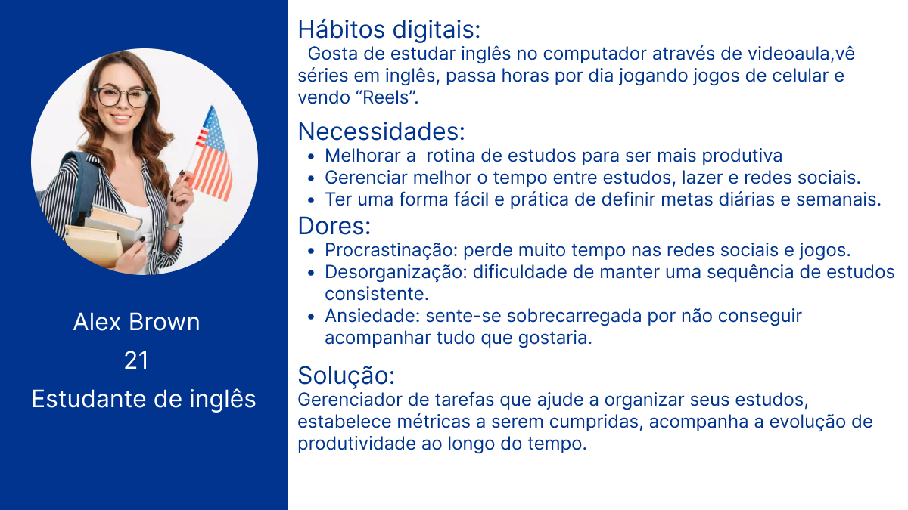

# Web Application Document - Projeto Individual - Módulo 2 - Inteli

**_Os trechos em itálico servem apenas como guia para o preenchimento da seção. Por esse motivo, não devem fazer parte da documentação final._**

## Nome do Projeto

#### Autor do projeto

## Sumário

1. [Introdução](#c1)  
2. [Visão Geral da Aplicação Web](#c2)  
3. [Projeto Técnico da Aplicação Web](#c3)  
4. [Desenvolvimento da Aplicação Web](#c4)  
5. [Referências](#c5)  

 

## 1. Introdução 

A aplicação WEB se trata de um organizador de tarefas focado a estudantes de inglês.A plataforma oferecerá funcionalidades como criação de tarefas, definição de prazos, categorização de atividades por tipo (estudo, lazer, revisão) e visualização de progresso. A aplicação terá uma boa interface para ajudar o estudante na sua caminhada de aprendizado e organização. Recompensas podem ser adicionadas para engajar os usuários a continuarem o seu progresso.

---

## 2. Visão Geral da Aplicação Web

### 2.1. Personas 

### 2.2. User Stories (Semana 01 - opcional)

US01:	Como estudante de inglês, eu quero criar tarefas de estudo para organizar o que preciso fazer.

US02:	Como estudante de inglês, eu quero categorizar minhas tarefas (estudo, lazer, revisão) para visualizar melhor minhas prioridades.

US03:	Como estudante de inglês, eu quero ganhar recompensas virtuais conforme concluo tarefas para me manter motivado.

Explicação do INVEST para User Story (US01)

I (Independente): A criação de tarefas não depende de outras funcionalidades.

N (Negociável): Pode ser ajustado conforme prioridades.

V (Valiosa): Ajuda muito a organizar o estudo do usuário, entregando valor imediato.

E (Estimável): Pode ser estimado com clareza para desenvolvimento em uma sprint.

S (Small - Pequena): A funcionalidade é pequena o suficiente para ser concluída rapidamente.

T (Testável): Pode ser testada criando e verificando tarefas dentro do sistema.

---

## 3. Projeto da Aplicação Web

### 3.1. Modelagem do banco de dados  (Semana 3)

*Posicione aqui os diagramas de modelos relacionais do seu banco de dados, apresentando todos os esquemas de tabelas e suas relações. Utilize texto para complementar suas explicações, se necessário.*

*Posicione também o modelo físico com o Schema do BD (arquivo .sql)*

### 3.1.1 BD e Models (Semana 5)
*Descreva aqui os Models implementados no sistema web*

### 3.2. Arquitetura (Semana 5)

*Posicione aqui o diagrama de arquitetura da sua solução de aplicação web. Atualize sempre que necessário.*

**Instruções para criação do diagrama de arquitetura**  
- **Model**: A camada que lida com a lógica de negócios e interage com o banco de dados.
- **View**: A camada responsável pela interface de usuário.
- **Controller**: A camada que recebe as requisições, processa as ações e atualiza o modelo e a visualização.
  
*Adicione as setas e explicações sobre como os dados fluem entre o Model, Controller e View.*

### 3.3. Wireframes (Semana 03 - opcional)

*Posicione aqui as imagens do wireframe construído para sua solução e, opcionalmente, o link para acesso (mantenha o link sempre público para visualização).*

### 3.4. Guia de estilos (Semana 05 - opcional)

*Descreva aqui orientações gerais para o leitor sobre como utilizar os componentes do guia de estilos de sua solução.*

### 3.5. Protótipo de alta fidelidade (Semana 05 - opcional)

*Posicione aqui algumas imagens demonstrativas de seu protótipo de alta fidelidade e o link para acesso ao protótipo completo (mantenha o link sempre público para visualização).*

### 3.6. WebAPI e endpoints (Semana 05)

*Utilize um link para outra página de documentação contendo a descrição completa de cada endpoint. Ou descreva aqui cada endpoint criado para seu sistema.*  

### 3.7 Interface e Navegação (Semana 07)

*Descreva e ilustre aqui o desenvolvimento do frontend do sistema web, explicando brevemente o que foi entregue em termos de código e sistema. Utilize prints de tela para ilustrar.*

---

## 4. Desenvolvimento da Aplicação Web (Semana 8)

### 4.1 Demonstração do Sistema Web (Semana 8)

*VIDEO: Insira o link do vídeo demonstrativo nesta seção*
*Descreva e ilustre aqui o desenvolvimento do sistema web completo, explicando brevemente o que foi entregue em termos de código e sistema. Utilize prints de tela para ilustrar.*

### 4.2 Conclusões e Trabalhos Futuros (Semana 8)

*Indique pontos fortes e pontos a melhorar de maneira geral.*
*Relacione também quaisquer outras ideias que você tenha para melhorias futuras.*

## 5. Referências

_Incluir as principais referências de seu projeto, para que o leitor possa consultar caso ele se interessar em aprofundar._ 

---
---
